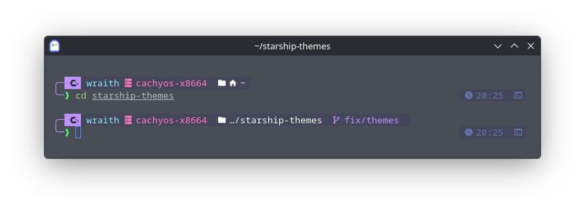
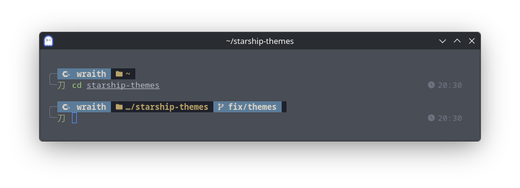
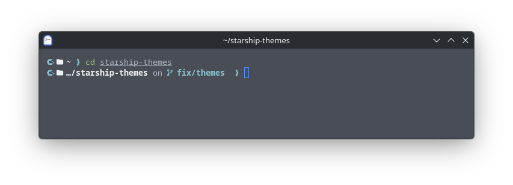
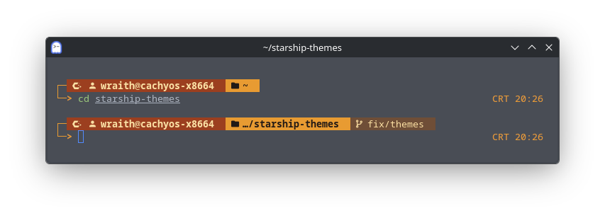
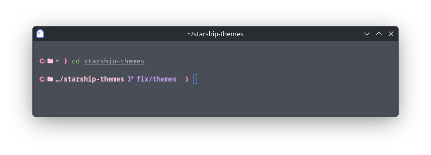
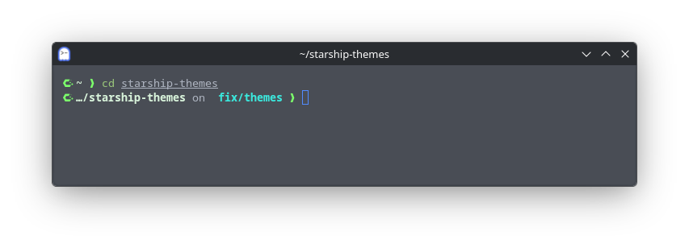
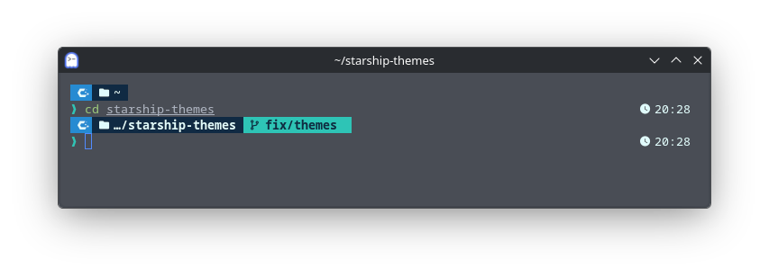
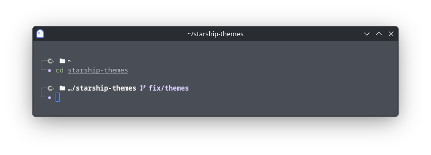

# Starship Themes

<p align="center">  </p> <p align="center"> <a href="LICENSE"></a> <a href="https://github.com/tirsasaki/starship-themes/stargazers"></a> <a href="https://github.com/tirsasaki/starship-themes/commits/main"></a> <a href="https://starship.rs"></a>  </p>

A collection of custom themes for [Starship](https://starship.rs). Each theme is distributed as a standalone TOML file, so you can install one without copying the rest of the repository.

The installer supports Zsh, Bash, and Fish; examples and troubleshooting use Zsh unless noted otherwise. Every theme uses Nerd Font icons, enables Starship's OS module, and automatically displays a matching icon for the detected operating system or Linux distribution. More themes, color palettes, layouts, and shell styles can be added over time.

## Quick start

Open the interactive theme selector:

```bash
sh -c "$(curl -fsSL https://raw.githubusercontent.com/tirsasaki/starship-themes/main/install.sh)"
```

Starship and a Nerd Font must be installed before using a theme; select the Nerd Font in your terminal emulator. See [Requirements](#requirements).

## Table of contents

- [Quick start](#quick-start)
- [Theme catalog](#theme-catalog)
- [Themes](#themes)
  - [Amethyst Night](#amethyst-night)
  - [Wabi Sabi](#wabi-sabi)
  - [Frostline](#frostline)
  - [Ember Retro](#ember-retro)
  - [Sakura Dawn](#sakura-dawn)
  - [Void Circuit](#void-circuit)
  - [Oceanic Pulse](#oceanic-pulse)
  - [Monochrome Orbit](#monochrome-orbit)
- [Requirements](#requirements)
- [Installation](#installation)
- [Switch or update a theme](#switch-or-update-a-theme)
- [Verify a theme](#verify-a-theme)
- [Customize a theme](#customize-a-theme)
- [Restore the previous configuration](#restore-the-previous-configuration)
- [Repository structure](#repository-structure)
- [Adding a theme](#adding-a-theme)
  - [Theme design rules](#theme-design-rules)
- [Preview image guidelines](#preview-image-guidelines)
- [Troubleshooting](#troubleshooting)
  - [Icons appear as boxes](#icons-appear-as-boxes)
  - [Starship does not appear](#starship-does-not-appear)
  - [A theme reports a configuration error](#a-theme-reports-a-configuration-error)
- [License](#license)

## Theme catalog

The **Style** column shows the prompt model used by each theme.

| Theme | Style | Colors | Configuration | Preview |
| --- | --- | --- | --- | --- |
| [Amethyst Night](#amethyst-night) | Two-line Powerline | Purple, pink, cyan | [`amethyst-night.toml`](themes/amethyst-night.toml) |  |
| [Wabi Sabi](#wabi-sabi) | Two-line segmented | Indigo, matcha, terracotta | [`wabi-sabi.toml`](themes/wabi-sabi.toml) |  |
| [Frostline](#frostline) | Compact one-line | Ice blue, navy, white | [`frostline.toml`](themes/frostline.toml) |  |
| [Ember Retro](#ember-retro) | Two-line block | Amber, rust, cream | [`ember-retro.toml`](themes/ember-retro.toml) |  |
| [Sakura Dawn](#sakura-dawn) | Compact one-line | Soft pink, lavender, gray | [`sakura-dawn.toml`](themes/sakura-dawn.toml) |  |
| [Void Circuit](#void-circuit) | Minimal one-line | Lime, cyan, near-black | [`void-circuit.toml`](themes/void-circuit.toml) |  |
| [Oceanic Pulse](#oceanic-pulse) | Developer dashboard | Teal, blue, coral | [`oceanic-pulse.toml`](themes/oceanic-pulse.toml) |  |
| [Monochrome Orbit](#monochrome-orbit) | Minimal two-line | White, gray, lavender | [`monochrome-orbit.toml`](themes/monochrome-orbit.toml) |  |

Preview images are stored in [`assets/previews/`](assets/previews/).

## Themes

### Amethyst Night

Amethyst Night is a two-line Powerline-style prompt with a purple palette inspired by Dracula and contextual development information on the right.

Included modules:

- OS, username, hostname, and directory
- Git branch and working-tree status
- command duration, exit status, time, and shell indicator
- Python, Node.js, Rust, Go, Docker, Terraform, and AWS when detected
- success, error, and Vim-mode prompt indicators

**Prompt model:** Two-line Powerline

**Palette:** Purple, pink, cyan

### Wabi Sabi

A restrained two-line prompt inspired by Japanese wabi-sabi aesthetics. Its indigo, bamboo, matcha, and terracotta palette keeps the directory and Git context distinct, while status, command duration, and time remain quietly aligned on the right.

Included modules:

- OS, username, and directory
- Git branch and working-tree status
- exit status, command duration, and time
- success, error, and Vim-mode prompt indicators

**Prompt model:** Two-line segmented

**Palette:** Indigo, matcha, terracotta

### Frostline

A compact one-line prompt with an ice-blue palette. It keeps the directory, Git state, detected language runtime, and command duration visible without taking another terminal row.

Included modules:

- OS and directory
- Git branch, operation state, and working-tree status
- Python, Node.js, Rust, Go, and package versions when detected
- command duration and exit status
- success, error, and Vim-mode prompt indicators

**Prompt model:** Compact one-line

**Palette:** Ice blue, navy, white

### Ember Retro

A warm two-line prompt inspired by amber CRT terminals. User and host information sit in a rust-colored block, while the working directory uses a brighter amber segment.

Included modules:

- OS, username, hostname, and directory
- Git branch and working-tree status
- command duration and time
- success, error, and Vim-mode prompt indicators

**Prompt model:** Two-line block

**Palette:** Amber, rust, cream

### Sakura Dawn

A soft pink and lavender one-line theme intended for bright or pastel terminal backgrounds. Git status uses small blossom markers to keep the layout light.

Included modules:

- OS, contextual username, and directory
- Git branch and working-tree status
- command duration and exit status
- success, error, and Vim-mode prompt indicators

**Prompt model:** Compact one-line

**Palette:** Soft pink, lavender, gray

### Void Circuit

A minimal one-line theme with a near-black palette that retains contextual development and Git information.

Included modules:

- OS and directory
- Git branch, operation state, and working-tree status
- Node.js, Python, Rust, and package versions when detected
- right-aligned exit status and command duration
- success, error, and Vim-mode prompt indicators

**Prompt model:** Minimal one-line

**Palette:** Lime, cyan, near-black

### Oceanic Pulse

A developer dashboard with project and Git context on the left, plus language runtimes, Docker, Kubernetes, command duration, and time on the right when detected.

Included modules:

- OS, directory, and Git branch/status
- Python, Node.js, Rust, and Go when detected
- Docker and Kubernetes context
- command duration, time, and exit status
- success, error, and Vim-mode prompt indicators

**Prompt model:** Developer dashboard

**Palette:** Teal, blue, coral

### Monochrome Orbit

A restrained two-line prompt using grayscale and one lavender accent. It remains readable in low-color setups while retaining clear success and error states.

Included modules:

- OS and directory
- Git branch and working-tree status
- command duration
- success, error, and Vim-mode prompt indicators

**Prompt model:** Minimal two-line

**Palette:** White, gray, lavender

## Requirements

The installer is intended for Linux, macOS, or another Unix-like environment with `/bin/sh`. Before installing a theme, make sure the following requirements are available:

Native Windows and PowerShell are not currently supported by the installer.

1. **[Starship](https://starship.rs/guide/#step-1-install-starship)** — required to render the prompt. When available, Starship is also used to validate the downloaded configuration. The installer can save a theme before Starship is installed, but the prompt will not appear until Starship is available.
2. **A supported shell** — Zsh, Bash, and Fish are detected automatically, and the installer adds the appropriate Starship initialization line. Other shells require [manual Starship setup](https://starship.rs/guide/#step-2-set-up-your-shell-to-use-starship).
3. **A download tool** — the commands in this README use `curl`. The installer itself can use either `curl` or `wget`.
4. **A [Nerd Font](https://www.nerdfonts.com/)** — required for the icons used by the themes. JetBrainsMono Nerd Font and MesloLGS Nerd Font are known options.

Check the command-line requirements with:

```bash
starship --version
basename "$SHELL"
command -v curl || command -v wget
```

After installing a Nerd Font, select it in your terminal emulator and restart the terminal. Installing the font without selecting it will leave some icons as empty boxes. Use Nerd Fonts 3.4.0 or newer for the dedicated CachyOS glyph; older versions may display it as a box.

## Installation

Review the installer before running it through a remote shell:

```bash
curl -fsSL https://raw.githubusercontent.com/tirsasaki/starship-themes/main/install.sh | less
```

Then open the interactive theme selector:

```bash
sh -c "$(curl -fsSL https://raw.githubusercontent.com/tirsasaki/starship-themes/main/install.sh)"
```

Use `↑`/`↓` or `j`/`k` to move, press `Enter` to install the highlighted theme, or press `q` to quit. **Amethyst Night** is highlighted by default.

The interactive selector reads directly from the terminal, so it still works when the installer is downloaded through command substitution. If no interactive terminal is available, it safely installs Amethyst Night.

To skip the menu and install a specific theme directly:

```bash
curl -fsSL https://raw.githubusercontent.com/tirsasaki/starship-themes/main/install.sh | sh -s -- frostline
```

The installer:

- shows a built-in terminal selector
- downloads the selected theme and validates it when Starship is installed
- backs up an existing `starship.toml` with a timestamp
- installs it to `${XDG_CONFIG_HOME:-$HOME/.config}/starship.toml`
- enables Starship automatically for Zsh, Bash, or Fish
- does not append another initialization line when the shell configuration already contains `starship init`

Starship must be installed before the prompt can appear. If you install a theme first, install Starship afterward, then open a new terminal to load the prompt.

List available theme names from the installer at any time:

```bash
curl -fsSL https://raw.githubusercontent.com/tirsasaki/starship-themes/main/install.sh | sh -s -- --list
```

## Switch or update a theme

Run the installer again to select another theme or reinstall the same theme by name. The current configuration is backed up automatically before it is replaced:

```bash
sh -c "$(curl -fsSL https://raw.githubusercontent.com/tirsasaki/starship-themes/main/install.sh)"
```

To switch or update directly by theme name:

```bash
curl -fsSL https://raw.githubusercontent.com/tirsasaki/starship-themes/main/install.sh | sh -s -- wabi-sabi
```

## Verify a theme

Check the active configuration:

```bash
starship print-config >/dev/null && echo "Starship theme loaded"
```

Test a repository theme before installing it:

```bash
git clone https://github.com/tirsasaki/starship-themes.git && cd starship-themes
```

From the repository root, run:

```bash
STARSHIP_CONFIG="$PWD/themes/amethyst-night.toml" starship prompt
```

## Customize a theme

The installed configuration is stored at:

```text
${XDG_CONFIG_HOME:-$HOME/.config}/starship.toml
```

Each theme selects a palette with `palette = '<theme_name>'` and defines its colors under `[palettes.<theme_name>]`. The current palette names are `amethyst_night`, `wabi_sabi`, `frostline`, `ember_retro`, `sakura_dawn`, `void_circuit`, `oceanic_pulse`, and `monochrome_orbit`.

Changing the installed file does not modify the repository copy. Running the installer again replaces `starship.toml` after creating a timestamped backup, so save a customized version under a separate filename:

```bash
cp "${XDG_CONFIG_HOME:-$HOME/.config}/starship.toml" ~/my-starship-theme.toml
```

## Restore the previous configuration

The installer creates timestamped backups next to `starship.toml`. List them, then restore the one you want:

```bash
config_dir="${XDG_CONFIG_HOME:-$HOME/.config}"
ls -1 "$config_dir"/starship.toml.backup-*
cp "$config_dir"/starship.toml.backup-YYYYMMDD-HHMMSS "$config_dir"/starship.toml
```

Open a new terminal after restoring it.

To remove the active theme without restoring another configuration:

```bash
rm "${XDG_CONFIG_HOME:-$HOME/.config}/starship.toml"
```

Open a new terminal afterward, or restart the current shell with `exec "$SHELL"`.

## Repository structure

```text
starship-themes/
├── assets/
│   └── previews/           # Theme screenshots
├── themes/
│   ├── amethyst-night.toml
│   ├── ember-retro.toml
│   ├── frostline.toml
│   ├── monochrome-orbit.toml
│   ├── oceanic-pulse.toml
│   ├── sakura-dawn.toml
│   ├── void-circuit.toml
│   └── wabi-sabi.toml
├── install.sh             # One-command installer
├── LICENSE
└── README.md
```

New themes should use a lowercase kebab-case filename, for example `violet-dawn.toml`. Its preview image should use the same base name, such as `assets/previews/violet-dawn.png`.

## Adding a theme

To add another theme:

1. Place the tested Starship configuration in `themes/<theme-name>.toml`.
2. Place its screenshot in `assets/previews/<theme-name>.png`.
3. Add it to the theme catalog.
4. Add a `###` theme section with a short description, an Included modules list, a Prompt model line, and a Palette line.
5. Test it with:

```bash
STARSHIP_CONFIG="$PWD/themes/<theme-name>.toml" starship print-config >/dev/null
STARSHIP_CONFIG="$PWD/themes/<theme-name>.toml" starship prompt
```

Submit additions through a pull request so the configuration and preview can be reviewed together.

### Theme design rules

Every completed theme should:

- have a unique palette and a clearly defined prompt model
- remain readable when a command fails or a Git repository is dirty
- include a matching file in `themes/` and preview in `assets/previews/`
- document any extra font or shell requirement
- avoid showing expensive modules unless their context is detected
- pass `starship print-config` and render successfully before being added to the catalog

## Preview image guidelines

Use PNG or WebP. Crop the image to the terminal area, keep text readable, and avoid including private paths, usernames, hostnames, tokens, or command history.

For a new theme:

1. Save the image as `assets/previews/<theme-name>.png`, or use `.webp` and keep the same extension in the catalog.
2. Add the theme to the catalog with its configuration and preview paths:

```markdown
| [Theme Name](#theme-name) | Prompt model | Colors | [`theme-name.toml`](themes/theme-name.toml) |  |
```

## Troubleshooting

### Icons appear as boxes

Select a Nerd Font in the terminal settings, then restart the terminal. JetBrainsMono Nerd Font and MesloLGS Nerd Font are known options.

### Starship does not appear

Check the configuration files for all three shells supported by the installer:

```bash
grep -nF "starship init" ~/.zshrc ~/.bashrc ~/.config/fish/config.fish 2>/dev/null
```

If the current shell has no initialization line, add the matching command to its configuration file:

Zsh — `~/.zshrc`:

```bash
eval "$(starship init zsh)"
```

Bash — `~/.bashrc`:

```bash
eval "$(starship init bash)"
```

Fish — `~/.config/fish/config.fish`:

```fish
starship init fish | source
```

If `XDG_CONFIG_HOME` is set, use `$XDG_CONFIG_HOME/fish/config.fish` instead of the default Fish path.

Open a new terminal after updating the file.

### A theme reports a configuration error

From the repository root, run Starship with the affected file:

```bash
STARSHIP_CONFIG="$PWD/themes/amethyst-night.toml" starship print-config
```

Starship will print the parsing error and its location. Replace the local configuration with an unmodified theme file if needed.

## License

The themes in this repository are available under the [MIT License](LICENSE).
