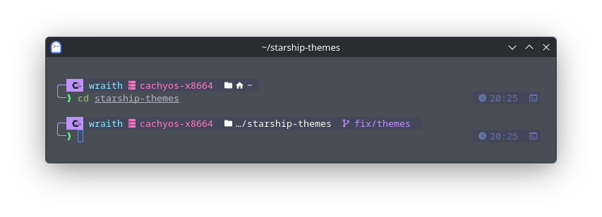
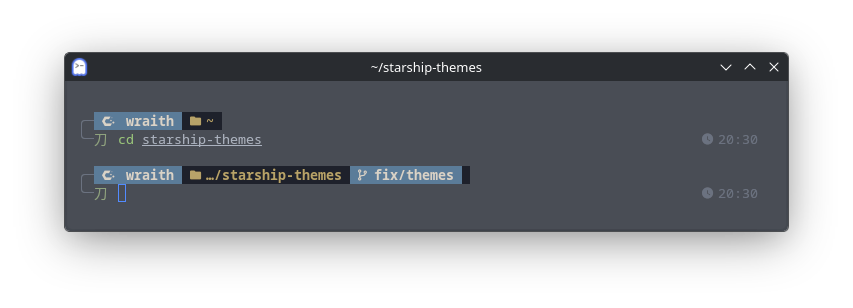
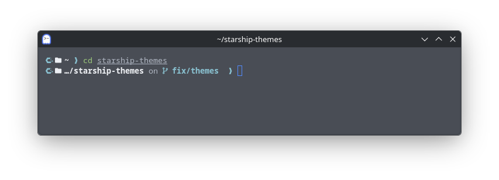
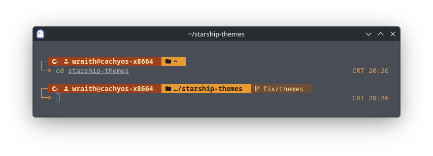
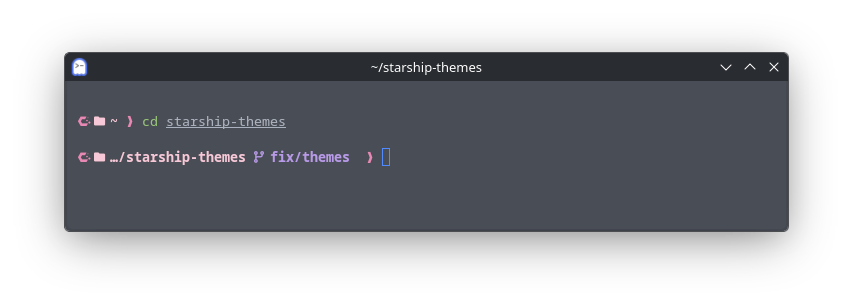
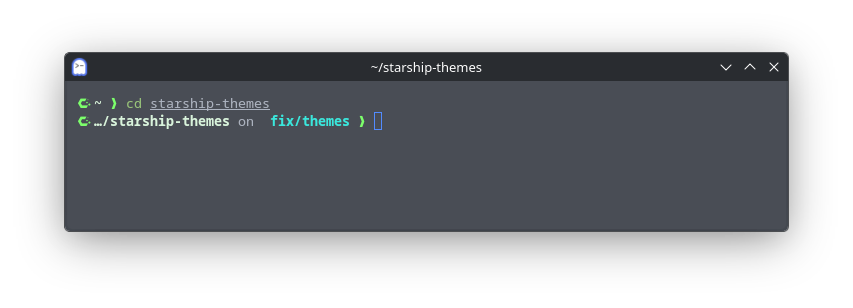
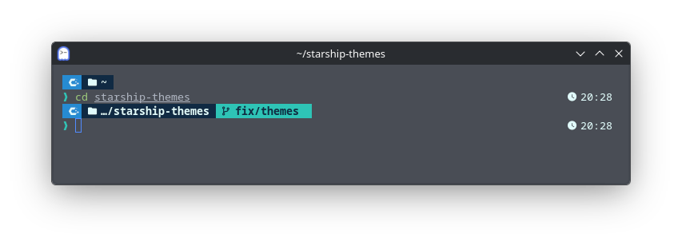
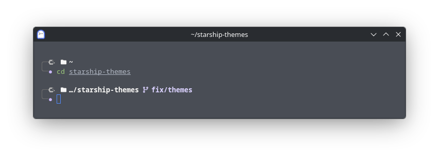

# Starship Themes

```bash
sh -c "$(curl -fsSL https://raw.githubusercontent.com/tirsasaki/starship-themes/main/install.sh)"
```

<p align="center">  </p> <p align="center"> <a href="LICENSE"></a> <a href="https://github.com/tirsasaki/starship-themes/stargazers"></a> <a href="https://github.com/tirsasaki/starship-themes/commits/main"></a> <a href="https://starship.rs"></a>  </p>

Eight hand-built themes for [Starship](https://starship.rs) — the minimal shell prompt. Each theme ships as a single standalone TOML file: pick one, run the installer, done. No dotfile surgery, no copying the whole repo.

Every theme uses Nerd Font icons, enables Starship's OS module (auto-detects your distro with a matching icon), and stays readable when a command fails or a repo gets dirty. The installer targets Zsh, Bash, and Fish; examples below use Zsh unless noted.

## Theme catalog

| Theme | Style | Colors | Config | Preview |
| --- | --- | --- | --- | --- |
| [Amethyst Night](#amethyst-night) | Two-line Powerline | Purple, pink, cyan | [`amethyst-night.toml`](themes/amethyst-night.toml) |  |
| [Wabi Sabi](#wabi-sabi) | Two-line segmented | Indigo, matcha, terracotta | [`wabi-sabi.toml`](themes/wabi-sabi.toml) |  |
| [Frostline](#frostline) | Compact one-line | Ice blue, navy, white | [`frostline.toml`](themes/frostline.toml) |  |
| [Ember Retro](#ember-retro) | Two-line block | Amber, rust, cream | [`ember-retro.toml`](themes/ember-retro.toml) |  |
| [Sakura Dawn](#sakura-dawn) | Compact one-line | Soft pink, lavender, gray | [`sakura-dawn.toml`](themes/sakura-dawn.toml) |  |
| [Void Circuit](#void-circuit) | Minimal one-line | Lime, cyan, near-black | [`void-circuit.toml`](themes/void-circuit.toml) |  |
| [Oceanic Pulse](#oceanic-pulse) | Developer dashboard | Teal, blue, coral | [`oceanic-pulse.toml`](themes/oceanic-pulse.toml) |  |
| [Monochrome Orbit](#monochrome-orbit) | Minimal two-line | White, gray, lavender | [`monochrome-orbit.toml`](themes/monochrome-orbit.toml) |  |

## Quick start

**1. Install Starship and a Nerd Font first.** The prompt can't render without them:
- Starship: <https://starship.rs/guide/#step-1-install-starship>
- Font: any [Nerd Font](https://www.nerdfonts.com/) (JetBrainsMono and MesloLGS are safe picks), then **select it in your terminal settings** and restart the terminal.

**2. Run the installer:**

```bash
sh -c "$(curl -fsSL https://raw.githubusercontent.com/tirsasaki/starship-themes/main/install.sh)"
```

Use `↑`/`↓` (or `j`/`k`) to browse, `Enter` to install, `q` to quit. **Amethyst Night** is pre-selected. Your existing `starship.toml` is backed up with a timestamp before anything is replaced, and the installer wires up `starship init` for Zsh, Bash, or Fish automatically.

Prefer to inspect the script first? Fair:

```bash
curl -fsSL https://raw.githubusercontent.com/tirsasaki/starship-themes/main/install.sh | less
```

Skip the menu and install by name:

```bash
curl -fsSL https://raw.githubusercontent.com/tirsasaki/starship-themes/main/install.sh | sh -s -- frostline
```

## Themes

### Amethyst Night

Two-line Powerline in a Dracula-inspired purple palette, with dev context on the right. The richest of the set — and the installer's default.

- OS, username, hostname, directory
- Git branch and working-tree status
- Command duration, exit status, time, shell indicator
- Python, Node.js, Rust, Go, Docker, Terraform, AWS when detected
- Success, error, and Vim-mode indicators

**Style:** two-line Powerline · **Colors:** purple, pink, cyan

### Wabi Sabi

A restrained two-line prompt with a Japanese wabi-sabi feel. Indigo, bamboo, matcha, and terracotta keep directory and Git context distinct; status, duration, and time sit quietly on the right.

- OS, username, directory
- Git branch and working-tree status
- Exit status, command duration, time
- Success, error, and Vim-mode indicators

**Style:** two-line segmented · **Colors:** indigo, matcha, terracotta

### Frostline

A compact one-liner in ice blue. Directory, Git state, language runtime, and command duration — all on a single row, nothing wasted.

- OS and directory
- Git branch, operation state, working-tree status
- Python, Node.js, Rust, Go, and package versions when detected
- Command duration and exit status
- Success, error, and Vim-mode indicators

**Style:** compact one-line · **Colors:** ice blue, navy, white

### Ember Retro

Warm two-line prompt channeling amber CRT terminals. User and host live in a rust block; the working directory glows in a brighter amber segment.

- OS, username, hostname, directory
- Git branch and working-tree status
- Command duration and time
- Success, error, and Vim-mode indicators

**Style:** two-line block · **Colors:** amber, rust, cream

### Sakura Dawn

Soft pink and lavender one-liner built for light or pastel terminal backgrounds. Git status uses small blossom markers to stay featherweight.

- OS, contextual username, directory
- Git branch and working-tree status
- Command duration and exit status
- Success, error, and Vim-mode indicators

**Style:** compact one-line · **Colors:** soft pink, lavender, gray

### Void Circuit

Minimal one-liner on near-black. Lime and cyan carry the signal; everything else gets out of the way — while Git and dev context stay one glance away.

- OS and directory
- Git branch, operation state, working-tree status
- Node.js, Python, Rust, and package versions when detected
- Right-aligned exit status and command duration
- Success, error, and Vim-mode indicators

**Style:** minimal one-line · **Colors:** lime, cyan, near-black

### Oceanic Pulse

A developer dashboard: project and Git context on the left; language runtimes, Docker, Kubernetes, duration, and time on the right when detected.

- OS, directory, Git branch/status
- Python, Node.js, Rust, Go when detected
- Docker and Kubernetes context
- Command duration, time, exit status
- Success, error, and Vim-mode indicators

**Style:** developer dashboard · **Colors:** teal, blue, coral

### Monochrome Orbit

Restrained two-liner in grayscale with a single lavender accent. Built for low-color setups — still crystal-clear about success vs. failure.

- OS and directory
- Git branch and working-tree status
- Command duration
- Success, error, and Vim-mode indicators

**Style:** minimal two-line · **Colors:** white, gray, lavender

## Requirements

Linux, macOS, or any Unix-like with `/bin/sh`. Native Windows/PowerShell isn't supported by the installer.

1. **[Starship](https://starship.rs/guide/#step-1-install-starship)** — renders the prompt. The installer can save a theme before Starship exists, but nothing appears until it's installed.
2. **Zsh, Bash, or Fish** — detected automatically; the init line is added for you. Other shells need [manual setup](https://starship.rs/guide/#step-2-set-up-your-shell-to-use-starship).
3. **`curl` or `wget`** — for downloading.
4. **A [Nerd Font](https://www.nerdfonts.com/)** — the icons depend on it. Use Nerd Fonts 3.4.0+ for the dedicated CachyOS glyph.

Sanity check:

```bash
starship --version
basename "$SHELL"
command -v curl || command -v wget
```

## Switching themes

Run the installer again — it backs up the current config first:

```bash
sh -c "$(curl -fsSL https://raw.githubusercontent.com/tirsasaki/starship-themes/main/install.sh)"
```

Or jump straight to one:

```bash
curl -fsSL https://raw.githubusercontent.com/tirsasaki/starship-themes/main/install.sh | sh -s -- wabi-sabi
```

List every available theme name:

```bash
curl -fsSL https://raw.githubusercontent.com/tirsasaki/starship-themes/main/install.sh | sh -s -- --list
```

## Verify & customize

Check the active config:

```bash
starship print-config >/dev/null && echo "Starship theme loaded"
```

Preview a theme without installing:

```bash
git clone https://github.com/tirsasaki/starship-themes.git && cd starship-themes
STARSHIP_CONFIG="$PWD/themes/amethyst-night.toml" starship prompt
```

The installed file lives at `${XDG_CONFIG_HOME:-$HOME/.config}/starship.toml`. Each theme picks its palette via `palette = '<name>'` with colors under `[palettes.<name>]`. Tweak freely — reinstalling backs up your version first, but keep your custom copy under a different filename so it survives:

```bash
cp "${XDG_CONFIG_HOME:-$HOME/.config}/starship.toml" ~/my-starship-theme.toml
```

Restore a backup:

```bash
config_dir="${XDG_CONFIG_HOME:-$HOME/.config}"
ls -1 "$config_dir"/starship.toml.backup-*
cp "$config_dir"/starship.toml.backup-YYYYMMDD-HHMMSS "$config_dir"/starship.toml
```

Remove the theme entirely: `rm "${XDG_CONFIG_HOME:-$HOME/.config}/starship.toml"`, then open a new terminal.

## Repository structure

```text
starship-themes/
├── assets/previews/      # Theme screenshots
├── themes/               # One TOML per theme
├── install.sh            # One-command installer
├── LICENSE
└── README.md
```

## Adding a theme

1. Drop the tested config in `themes/<theme-name>.toml` (lowercase kebab-case).
2. Add its screenshot as `assets/previews/<theme-name>.png`.
3. Add a catalog row and a theme section (description, module list, style, palette).
4. Validate:

```bash
STARSHIP_CONFIG="$PWD/themes/<theme-name>.toml" starship print-config >/dev/null
STARSHIP_CONFIG="$PWD/themes/<theme-name>.toml" starship prompt
```

Design rules: unique palette and clear prompt model, readable on failure/dirty repos, no expensive modules unless their context is detected, and document any extra font or shell needs. Submit via pull request so config and preview get reviewed together.

Preview guidelines: PNG or WebP, cropped to the terminal, text readable, no private paths, usernames, hostnames, tokens, or command history.

## Troubleshooting

**Icons show as boxes** — select a Nerd Font in your terminal settings and restart the terminal.

**Starship doesn't appear** — check the init line:

```bash
grep -nF "starship init" ~/.zshrc ~/.bashrc ~/.config/fish/config.fish 2>/dev/null
```

Add the matching line if missing, then open a new terminal:

```bash
eval "$(starship init zsh)"   # ~/.zshrc
eval "$(starship init bash)"  # ~/.bashrc
```

```fish
starship init fish | source   # ~/.config/fish/config.fish
```

**A theme reports a config error** — Starship will point at the problem:

```bash
STARSHIP_CONFIG="$PWD/themes/amethyst-night.toml" starship print-config
```

## License

MIT — see [LICENSE](LICENSE).
